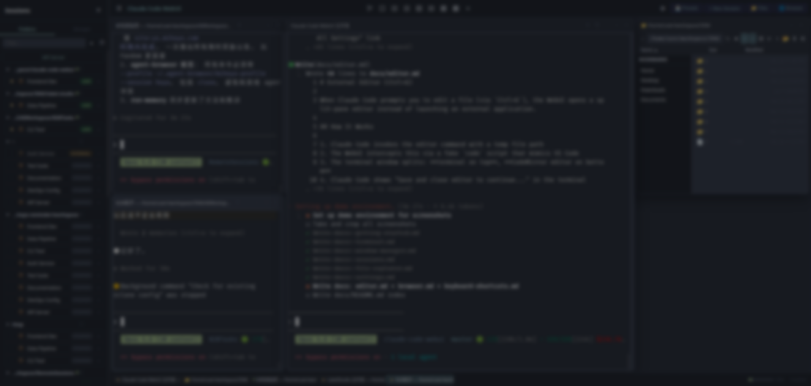

# Getting Started

## Prerequisites

| Dependency | macOS | Ubuntu/Debian |
|-----------|-------|---------------|
| **Node.js 18+** | `brew install node` | See [NodeSource](https://github.com/nodesource/distributions) |
| **dtach** | `brew install dtach` | `sudo apt install dtach` |
| **Claude CLI** | `npm install -g @anthropic-ai/claude-code` | same |

After installing Claude CLI for the first time, run `claude` once in your terminal to complete login/setup.

## Installation

### One-line install

```bash
curl -fsSL https://raw.githubusercontent.com/ProblemFactory/claude-code-webui/master/install.sh | bash
```

The installer checks dependencies, prompts for install location (default `~/claude-code-webui`), clones the repo, and builds.

### Manual install

```bash
git clone https://github.com/ProblemFactory/claude-code-webui.git
cd claude-code-webui
npm install
npm run build
```

> **macOS note**: If `npm install` fails with node-pty errors, run `npm rebuild node-pty --build-from-source`.

## Running

```bash
cd ~/claude-code-webui
npm start
```

Open **http://localhost:3456** in your browser. On startup, a loading screen is displayed while the workspace restores your previous session layout. It fades away once all windows are created.

### Environment variables

| Variable | Default | Description |
|----------|---------|-------------|
| `PORT` | `3456` | Server port |
| `HOST` | `0.0.0.0` | Bind address (`127.0.0.1` for local-only) |
| `CLAUDE_CMD` | `claude` | Path to Claude CLI binary |

Example: `PORT=8080 HOST=127.0.0.1 npm start`

## Quick Tour



The UI has four main areas:

1. **Sidebar** (left) — Session list grouped by working directory. Star, archive, rename, and organize sessions into groups.
2. **Workspace** (center) — Tiling window manager with draggable, resizable windows for terminals, chat views, file explorers, editors, and browsers.
3. **Toolbar** (top of workspace) — Theme selector, layout presets, grid controls, new session, settings.
4. **Taskbar** (bottom) — Active window tabs, usage monitor, "x active" count.

### Creating your first session

1. Click **"+ New Session"** in the toolbar or sidebar
2. Enter a working directory (with autocomplete) and optional CLI arguments
3. Choose **Terminal** or **Chat** mode (default is configurable in Settings > Session Card > Default session mode)
4. A window opens with your Claude Code session

**Terminal mode** gives you the full Claude Code TUI via xterm.js. **Chat mode** gives you a structured message view with markdown rendering, tool visualization, and interactive permission prompts. See [Chat Mode](chat-mode.md) for details.

### Opening a file explorer

- Press `Ctrl+\` then `e` (command mode)
- Or click the folder icon in the toolbar

### Resuming existing sessions

The sidebar auto-discovers all Claude Code sessions on your machine:
- **LIVE** — WebUI-managed sessions (click to focus)
- **TMUX** — Running in tmux (click to view, closing won't kill it)
- **EXTERNAL** — Running in another terminal (view-only)
- **STOPPED** — Click to resume via `claude --resume`

When resuming a stopped session, a split button lets you choose Terminal or Chat mode. The mode you last used for a session is remembered.

## Updating

```bash
cd ~/claude-code-webui
git pull
npm install
npm run build
```

Or re-run the one-line install command.

## Next steps

- [Chat Mode](chat-mode.md) — Structured messages, tool visualization, permissions, subagents
- [Terminal Management](terminal.md) — Session persistence, multi-device sync, clipboard paste
- [Window Manager](window-manager.md) — Grid layouts, command mode, presets
- [Session Management](sessions.md) — Groups, star/archive, filters
- [Keyboard Shortcuts](keyboard-shortcuts.md) — Complete reference
