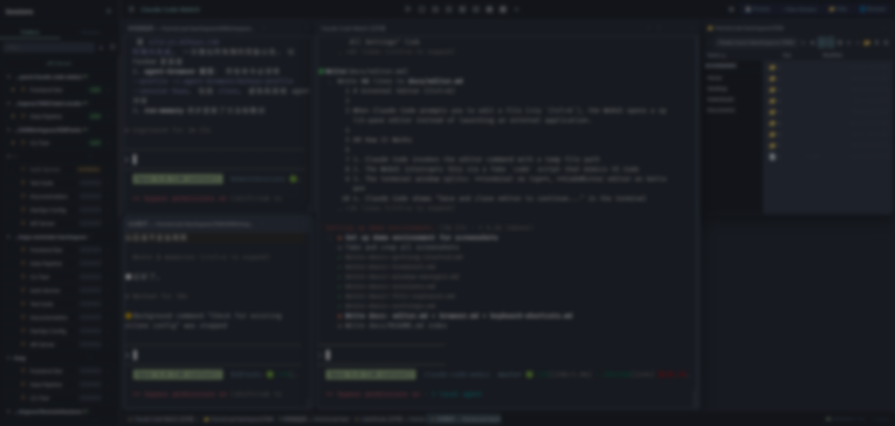

# Getting Started

VibeSpace is a backend-agnostic workspace for coding agents. You bring the agent CLI(s) — Claude Code, Codex, or another harness wired up via an adapter — and VibeSpace adds persistent multi-session management, a tiling window manager, and a structured chat view on top.

## Prerequisites

You need Node.js, dtach, and **at least one** agent backend CLI.

| Dependency | macOS | Ubuntu/Debian |
|-----------|-------|---------------|
| **Node.js 18+** | `brew install node` | See [NodeSource](https://github.com/nodesource/distributions) |
| **dtach** | `brew install dtach` | `sudo apt install dtach` |
| **An agent CLI** (≥1) | | |
| &nbsp;&nbsp;• Claude Code | `npm install -g @anthropic-ai/claude-code` | same |
| &nbsp;&nbsp;• Codex | install `codex`, ensure it's on `PATH` | same |

After installing a backend CLI for the first time, run it once in your terminal to complete login/setup:
- `claude` for Claude Code sessions
- `codex` for Codex sessions

## Installation

### One-line install

```bash
curl -fsSL https://raw.githubusercontent.com/ProblemFactory/vibespace/master/install.sh | bash
```

The installer checks dependencies, prompts for install location (default `~/vibespace`), clones the repo, and builds.

### Manual install

```bash
git clone https://github.com/ProblemFactory/vibespace.git
cd vibespace
npm install
npm run build
```

> **macOS note**: If `npm install` fails with node-pty errors, run `npm rebuild node-pty --build-from-source`.

## Running

```bash
cd ~/vibespace
npm start
```

Open **http://localhost:3456** in your browser. On startup, a loading screen is displayed while the workspace restores your previous session layout. It fades away once all windows are created.

### Environment variables

| Variable | Default | Description |
|----------|---------|-------------|
| `PORT` | `3456` | Server port |
| `HOST` | `0.0.0.0` | Bind address (`127.0.0.1` for local-only) |
| `CLAUDE_CMD` | `claude` | Path to Claude CLI binary |
| `CODEX_CMD` | `codex` | Path to Codex CLI binary |

Example: `PORT=8080 HOST=127.0.0.1 CODEX_CMD=/usr/local/bin/codex npm start`

## HTTPS for seamless copy

When you open VibeSpace by a machine name over plain http (`http://<hostname>:3456`), the browser treats the page as **not secure** and gives it no clipboard API. That matters for **desktop apps** (⚙ → Desktop apps…): a copy made inside the app has to reach your own clipboard.

- **A copy you make yourself works anyway.** Press Ctrl+C (⌘+C) in the app window: the app's copy arrives within the few seconds the browser allows after a key press, and VibeSpace writes it to your clipboard with no extra click.
- **A copy you did not make on this page** (an agent's, an app copying on a timer, a copy made on another device) cannot be written without a click on plain http. It shows as a **"Copied in the app — click to copy"** chip; one click copies it. The first time the chip appears on a device, a one-time hint links here.
- **Paste works on plain http** (Ctrl+V in the app window, or the Paste button's paste box).

To make every copy seamless, serve the page over **HTTPS**. VibeSpace does not terminate TLS itself; use one of these three routes:

1. **No infrastructure, this browser only (Chrome / Edge):** open `chrome://flags/#unsafely-treat-insecure-origin-as-secure`, add `http://<hostname>:3456`, set the flag to *Enabled* and restart the browser. The page then counts as secure in that browser, so the clipboard API is there. Other browsers and devices are unchanged.
2. **Tailscale:** on the VibeSpace machine run `tailscale serve --bg 3456`. Tailscale issues the certificate; open `https://<machine>.<tailnet>.ts.net` instead.
3. **A reverse proxy (for example Caddy):** a two-line `Caddyfile`:
   ```
   <hostname> {
     reverse_proxy 127.0.0.1:3456
   }
   ```
   For a name without a public certificate, Caddy uses its own local certificate authority — trust it once in your browser (or the operating system), then open `https://<hostname>`.

`localhost` / `127.0.0.1` is already a secure context, so a browser on the VibeSpace machine itself needs none of this.

## Quick Tour



The UI has four main areas:

1. **Sidebar** (left) — Session list grouped by working directory. Star, archive, rename, and organize sessions into tasks.
2. **Workspace** (center) — Tiling window manager with draggable, resizable windows for terminals, chat views, file explorers, editors, and browsers.
3. **Toolbar** (top of workspace) — Theme selector, layout presets, grid controls, new session, settings.
4. **Taskbar** (bottom) — Window tabs, virtual desktop previews, backend usage pies, window count. Drag the top edge to resize.

### Creating your first session

1. Click **"+ New Session"** in the toolbar or sidebar
2. Choose a backend: **Claude** or **Codex**
3. Enter a working directory (with autocomplete) and optional CLI arguments
4. Choose **Terminal** or **Chat** mode (default is configurable in Settings > Session > Default session mode)
5. A window opens with your session

**Terminal mode** gives you the full backend TUI via xterm.js. **Chat mode** gives you a structured message view with markdown rendering, tool visualization, live thinking/status updates, and interactive permission prompts. See [Chat Mode](chat-mode.md) for details.

The new-session dialog applies backend-specific defaults from Settings:
- **Claude**: default model, permission mode, effort, extra args
- **Codex**: default model, permission mode, reasoning effort, extra args

### Opening a file explorer

- Press `Ctrl+\` then `e` (command mode)
- Or click the folder icon in the toolbar

### Resuming existing sessions

The sidebar auto-discovers both Claude Code sessions and Codex threads on your machine:
- **Claude** sessions can appear as **LIVE**, **TMUX**, **EXTERNAL**, or **STOPPED**
- **Codex** threads can appear as **LIVE**, **EXTERNAL**, or **STOPPED**

When resuming a stopped session, a split button lets you choose Terminal or Chat mode. The mode you last used for a session is remembered, and backend-specific defaults are re-applied when a session is resumed from the sidebar.

## Updating

```bash
cd ~/vibespace
git pull
npm install
npm run build
```

Or re-run the one-line install command.

## Contributing: the release gate

`git push` is gated by a tracked pre-push hook (installed by `npm install`). Since 2026-09-07 the gate has **two tiers**, because one 11.5-minute battery is a gate people learn to skip:

| | command | what it runs | when |
|---|---|---|---|
| **Fast** | `npm run ci` | build + every suite under ~10 s + one real chat turn | **before** the push — a red here blocks it |
| **Heavy** | `npm run ci:heavy` | headless-chrome UI suites, real worktree servers, real agent CLIs, the real `opencode` binary | **after** the push, launched detached by the hook in its own worktree at the pushed commit |

The heavy tier writes `data/ci-heavy/<sha>.green` or `.red` (gitignored). **A red result blocks your *next* push** — with the failing suite names and the log path — until a green heavy run exists for a newer commit. The question is asked about every ref you are pushing, not about whichever branch you happen to be standing on. So the feedback stays out of your critical path, but nothing gets stacked on top of a commit that is known to be broken.

```bash
npm run ci          # the fast gate (what the hook runs)
npm run ci:heavy    # the heavy tier at HEAD, in its own worktree — this is
                    #   what clears a block, so it always writes a marker
npm run ci:status   # last heavy result per commit + is HEAD blocked?
```

**Only one heavy tier runs per machine.** Its suites bind ports and check worktrees out at shared `/tmp` paths, so a second run waits for a lock (`ci:status` shows who holds it) and a run started for a commit your new one descends from is superseded. A run that never gets its turn writes **no verdict** and says so — it never looks like a pass. If you run `node scripts/ci.mjs --heavy` against a dirty tree it refuses immediately, because a marker names a commit and your tree is not that commit; `--dirty-ok` runs it anyway with no verdict.

The same rows appear in ⚙ → **Diagnostics report…** under *Release gate — heavy tier*. Docs-only pushes skip the gate entirely; `VIBESPACE_SKIP_CI=1 git push` is the emergency bypass. Every suite under `scripts/test-*.mjs` is in exactly one tier or in `scripts/ci.mjs`'s `EXCLUDED` list with a stated reason — `npm run build` fails if a new suite is in neither.

## Next steps

- [Chat Mode](chat-mode.md) — Structured messages, tool visualization, permissions, subagents
- [Terminal Management](terminal.md) — Session persistence, multi-device sync, clipboard paste
- [Window Manager](window-manager.md) — Grid layouts, command mode, presets
- [Session Management](sessions.md) — Tasks, star/archive, filters
- [Keyboard Shortcuts](keyboard-shortcuts.md) — Complete reference
